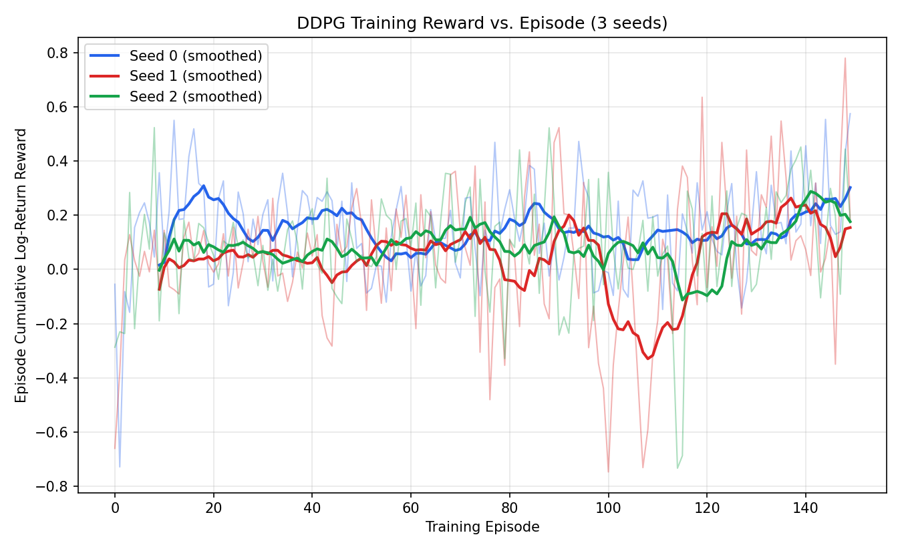
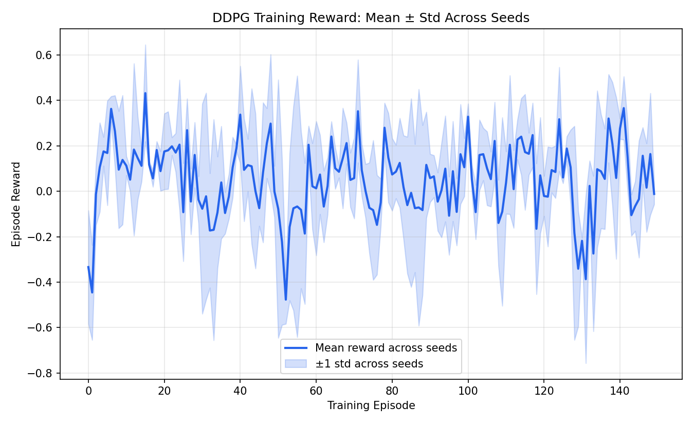
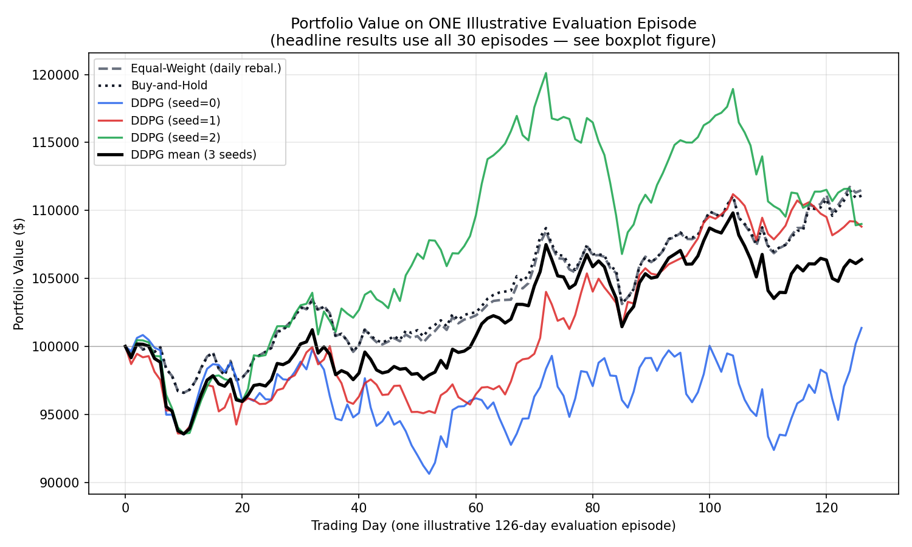
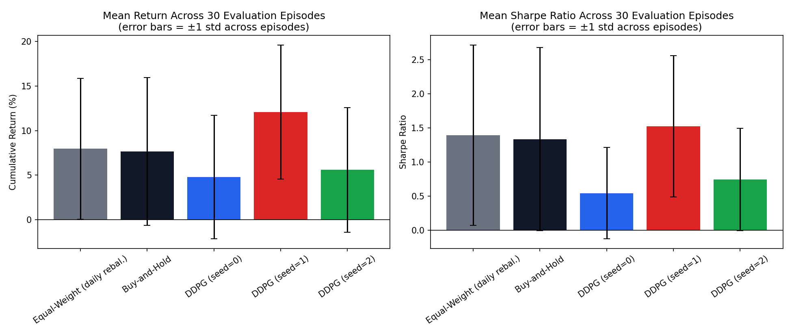
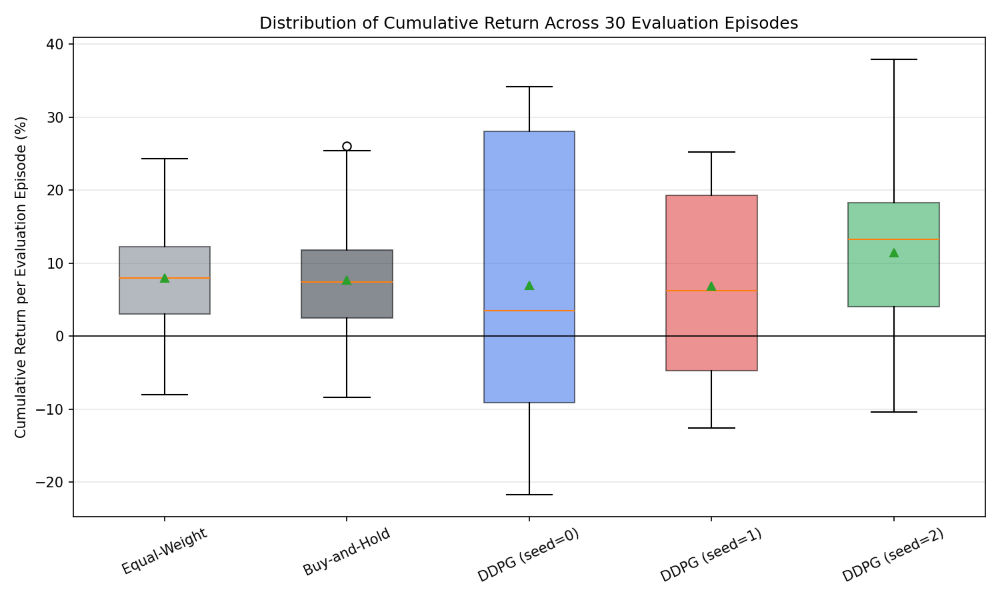

# Dynamic Portfolio Allocation with DDPG

Implementation and evaluation of Deep Deterministic Policy Gradient (DDPG) applied to continuous multi-asset portfolio allocation, trained and evaluated on real historical S&P 500 daily price data (AAPL, XOM, JNJ, JPM, PG, CAT; 2015–2025).

Course: DSCD 614 Reinforcement Learning: Group Project-Based Examination, Option **DDPG-1: Dynamic Portfolio Allocation** Group: **Group 10**.

---

## Quick Start

### 1. Install

```bash
python -m venv venv
source venv/bin/activate        # Windows: venv\Scripts\activate
pip install -r requirements.txt
```

Dependencies are pinned to exact versions in `requirements.txt`.

### 2. Reproduce the headline result from a clean environment

```bash
python reproduce.py
```

This single entry point runs the full pipeline end to end (~15–20 minutes on a laptop CPU):
1. Trains the DDPG agent for 3 random seeds (150 episodes each): `train.py`
2. Evaluates all 3 trained policies, and both baselines, on 30 held-out evaluation episodes each, under identical conditions: `evaluate.py`
3. Regenerates every figure in this report: `generate_plots.py`

Each of these three scripts can also be run individually, in the same order, if you want to inspect intermediate output.

### 3. Explore results interactively 

```bash
streamlit run dashboard.py
```

Then open <http://localhost:8600>. The port and the light theme are pinned in
`.streamlit/config.toml` so the dashboard looks identical on every machine; see
Troubleshooting if the port is unavailable. Run this *after* `reproduce.py` has
finished rather than alongside it — training saturates every CPU core and the
dashboard will be starved of the cycles it needs to render.

### 4. Reproducing individual figures

| Figure                                         | Script | Output file |
|------------------------------------------------|---|---|
| Fig. 1: Training reward per episode            | `generate_plots.py` → `plot_training_rewards()` | `plots/training_reward_curve.png` |
| Fig. 2: Mean training reward ± std             | `generate_plots.py` → `plot_training_rewards()` | `plots/training_reward_mean_std.png` |
| Fig. 3: Illustrative episode portfolio value   | `generate_plots.py` → `plot_test_portfolio_comparison()` | `plots/test_portfolio_value_comparison.png` |
| Fig. 4: Mean return/Sharpe across 30 episodes  | `generate_plots.py` → `plot_metrics_bars()` | `plots/metrics_comparison_bars.png` |
| Fig. 5: Return distribution across 30 episodes | `generate_plots.py` → `plot_episode_distribution()` | `plots/episode_return_distribution.png` |

All figures regenerate from the raw logs committed under `results/` (`training_log.json`, `eval_episode_log.csv`, `test_metrics.csv`), so every number in this report is traceable to a committed log file.

---

## Repository Structure

```
.
├── agent/
│   └── ddpg_agent.py          # DDPG actor, critic, replay buffer, OU noise (from-scratch, attributed to Lillicrap et al. 2016)
├── env/
│   └── portfolio_env.py       # Custom Gymnasium MDP environment
├── real_data/                 # Raw per-ticker OHLCV CSVs (AAPL, XOM, JNJ, JPM, PG, CAT)
├── results/                   # Committed raw logs: training_log.json, eval_episode_log.csv, test_metrics.csv, actor_seed*.pt
├── plots/                     # All figures (rendered below)
├── data_loader_real.py        # Loads and aligns the real S&P 500 data
├── data_gen.py                # Synthetic data generator (not used for reported results; kept as an offline-safe fallback)
├── utils.py                   # Evaluation metrics + baseline strategies
├── train.py                   # Multi-seed DDPG training loop
├── evaluate.py                # 30-episode-per-seed evaluation harness vs. baselines
├── generate_plots.py          # Regenerates all figures from results/
├── reproduce.py               # Single entry point: train + evaluate + plot
├── dashboard.py                # Interactive Streamlit dashboard
├── .streamlit/config.toml     # Pinned dashboard theme and port (see Troubleshooting)
├── Project_Report.pdf         # The submitted project report
├── requirements.txt           # Pinned exact dependency versions
└── .gitignore
```

---

# Project Report

## Abstract

This report presents the implementation and evaluation of Deep Deterministic Policy Gradient (DDPG) applied to dynamic, continuous-action portfolio allocation across six S&P 500 equities (2015–2025). The task is formulated as a finite-horizon Markov Decision Process and implemented as a custom Gymnasium environment. The agent is trained across three random seeds and evaluated, with exploration disabled, on 30 held-out evaluation episodes per seed, sampled from a chronologically separate test period; the required baseline (equal-weight and buy-and-hold portfolios) is evaluated on the identical 30 episodes for a controlled comparison. Averaged across seeds, the DDPG agent's mean cumulative return (8.46%) is close to both baselines (7.96% and 7.66%); the +0.49 percentage-point gap over equal-weight is far smaller than the cross-seed standard deviation of DDPG's own performance (2.60 percentage points) and therefore cannot, with only three seeds, be distinguished from seed-to-seed training noise. DDPG also assumes materially higher volatility (22.3% vs ≈14%) and deeper drawdown (−14.1% vs ≈−8.7%) than either baseline. This is reported and diagnosed as an inconclusive result: the agent shows no clear evidence of improving on, or clearly underperforming, simple heuristics under this protocol, and the report attributes the remaining risk-adjusted shortfall (lower Sharpe ratio despite comparable return) primarily to a reward function that does not penalize variance, the absence of hyperparameter tuning, and known instability properties of vanilla DDPG relative to later continuous-control algorithms. Two rounds of defect-hunting are documented in Section 4.7: a partial random-seed control bug (the environment's training-episode sampling and warm-up action randomness were not originally tied to the specified seed), and a subsequent code review that found six further implementation defects in the environment, agent and metric code. All were corrected and the whole pipeline re-run; the figures reported here are from that corrected run, and the qualitative conclusion is unchanged by the corrections.

## 1. Introduction

Portfolio allocation is the recurring decision of how to distribute investment capital across a set of financial assets and this is a sequential decision-making problem under uncertainty, and is therefore naturally amenable to formulation as a Markov Decision Process (MDP). Classical approaches such as mean-variance optimization typically rely on static, single-period assumptions and require explicit estimation of return distributions. Reinforcement learning offers an alternative in which an adaptive, multi-period allocation policy is learned directly from historical data.

This project addresses catalogue option **DDPG-1 (Dynamic Portfolio Allocation)**. Because portfolio weights are continuous, the problem is naturally suited to continuous-control RL rather than discrete-action methods. Deep Deterministic Policy Gradient [1] was among the first deep RL algorithms designed explicitly for continuous action spaces and is a standard baseline in applied financial RL research [2]. The project's significance is not in achieving state-of-the-art trading performance where the specification explicitly does not assess the score achieved but in producing a correctly formulated MDP, a correctly implemented agent, and a controlled, statistically honest comparison against the required baseline, including a full diagnosis of whatever result is actually obtained.

## 2. Background

DDPG extends the deterministic policy gradient theorem [3] to high-dimensional continuous action spaces using the experience replay and target-network techniques from Deep Q-Networks [4]. Later work identified and addressed specific weaknesses of DDPG: Twin Delayed DDPG (TD3) [5] mitigates value overestimation via clipped double-Q learning and delayed policy updates, and Soft Actor-Critic (SAC) [6] adds entropy regularization for improved exploration and stability. These successor algorithms are directly relevant to the interpretation of this project's results, since several instability phenomena observed below are exactly what TD3 and SAC were designed to address.

In computational finance, the open-source FinRL framework [2] has standardized environment design for RL-based trading and portfolio management and has demonstrated DDPG, among other algorithms, on multi-asset allocation tasks. A recurring finding in this literature is that reward design, particularly the treatment of transaction costs and risk  materially affects both policy quality and training stability, a theme this project examines directly through its transaction-cost-aware reward and its evaluation protocol.

## 3. Problem Formulation

The task is formulated as a finite-horizon MDP with the following components.

**State space.** A continuous vector *s_t ∈ R^86*, comprising, for each of the six assets: a rolling 10-day window of log-returns (60 values) and three technical indicators, a simple-moving-average ratio, a momentum measure, and a short-term volatility signal (18 values)  together with the agent's current portfolio weights (6 values), a cash-ratio placeholder, and the realized volatility of the portfolio's own recent returns (2 values). All components are continuous and are scale-free by construction (returns, ratios), so no additional normalization layer was applied.

**Action space.** A continuous vector *a_t ∈ R^6* of unconstrained logits in [-5, 5], transformed via a softmax function into a valid, fully invested, long-only allocation (non-negative weights summing to 1).

**Reward function.**

> r_t = ln(V_{t+1} / V_t) − λ · c · Σᵢ |w_target,i − w_drift,i|

where *V_t* is portfolio value, *c* = 0.001 is the proportional transaction-cost rate, *λ* = 0.5 is an additional turnover-penalty weight, *w_target* = softmax(a_t) is the newly chosen allocation, and *w_drift* is the previous day's holdings after they have drifted with each asset's realized return (i.e. turnover is measured against the actual pre-trade holdings, not the previous day's target).

**Episode termination and truncation** (stated separately, as required).
- *Termination:* the episode ends early if portfolio value falls below 30% of initial capital a catastrophic-loss stop.
- *Truncation:* the episode ends at a fixed horizon: 250 trading days during training, or 126 trading days during evaluation (see Section 4.4), or at the end of the available price series.

**Discount factor.** γ = 0.99, giving an effective horizon of 1/(1−γ) = 100 trading days (~4.8 calendar months). This value was adopted directly from the hyperparameters reported in Lillicrap et al. [1] rather than tuned on this task (see Section 4.3). It is judged appropriate because it is of the same order of magnitude as the 126-day evaluation episode length and shorter than the 250-day training episode length, so the discounted objective does not extend the agent's effective planning horizon far beyond the periods it is actually trained and evaluated on. No systematic sensitivity analysis of γ was conducted, within the project's time constraint; this is stated as a limitation (Section 7).

**Does the Markov property hold?** No, not strictly. Financial return series are not Markovian in raw price space: momentum, mean-reversion, and volatility-clustering effects extend beyond any fixed-length window, and the constructed state omits information such as order-book microstructure, macroeconomic indicators, and information about assets outside the six-ticker universe. The true process is therefore better characterized as a Partially Observable MDP (POMDP), of which the constructed state is an approximate sufficient statistic rather than the true underlying market state. The implementation compensates for this via state augmentation including a rolling window of returns and technical indicators specifically because they summarize recent history in a fixed-length vector which is a standard, accepted approximation in applied deep RL (analogous to frame-stacking in Atari-DQN), but remains an approximation: the 10-day window length is a hyperparameter trading off state dimensionality against captured history, and no claim is made that the resulting process is truly Markovian.

## 4. Methodology

### 4.1 Data

Historical daily price data were obtained from the Kaggle dataset "S&P 500 Stocks. Daily Historical Data (10 Years)" [7]. A sector-diverse subset of six equities was selected AAPL (Technology), XOM (Energy), JNJ (Healthcare), JPM (Financials), PG (Consumer Staples), CAT (Industrials) screened for complete data coverage and for pairwise return correlations (0.22–0.60) consistent with genuine diversification potential. The aligned 2,515-day series was split chronologically into a training set (first 80%, ≈2,012 days, Dec 2015–mid 2023) and a held-out test set (final 20%, ≈503 days, through Dec 2025), never accessed during training.

### 4.2 Agent Architecture

DDPG was implemented from first principles in PyTorch (no RL library such as Stable-Baselines3 was used), following [1]; see attribution comment in `agent/ddpg_agent.py`. The actor is a two-hidden-layer network (256, 128 units, ReLU, tanh output scaled to the action bound); the critic has matching hidden-layer dimensionality. Both are paired with Polyak-averaged target networks. An experience replay buffer (capacity 100,000) is sampled in batches of 128. Exploration uses a temporally correlated Ornstein-Uhlenbeck process, annealed from σ=0.4 to σ=0.05 over training.

### 4.3 Hyperparameters and Seeds

All hyperparameters were held constant across the three training seeds (0, 1, 2). No hyperparameter search was conducted: values follow [1] and standard DDPG reference settings, adopted without tuning on this task's data, given the 14-day project scoping constraint. This means reported performance reflects an untuned, first-attempt capability of DDPG on this task rather than its best achievable performance.

| Hyperparameter | Value |
|---|---|
| Discount factor (γ) | 0.99 |
| Soft target update rate (τ) | 0.005 |
| Actor learning rate | 1 × 10⁻⁴ |
| Critic learning rate | 1 × 10⁻³ |
| Replay buffer capacity | 100,000 |
| Batch size | 128 |
| Actor/critic hidden layers | (256, 128), ReLU |
| OU noise: θ, σ (start → end), dt | 0.15, 0.4 → 0.05, 1.0 |
| Gradient clip norm | 1.0 |
| Training episodes per seed | 150 |
| Training episode length | 250 trading days (random start within training data) |
| Warm-up steps (random actions) | 500 |
| Transaction cost rate (c) | 0.001 |
| Turnover penalty weight (λ) | 0.5 |
| Early-termination threshold | 30% of initial capital |
| Random seeds | 0, 1, 2 |
| Evaluation episodes per seed | 30 |
| Evaluation episode length | 126 trading days |

### 4.4 Baseline

As specified by the catalogue, the required baseline is an equal-weighted or buy-and-hold portfolio; **both** are implemented. The equal-weight strategy rebalances to 1/6 per asset daily, incurring transaction costs whenever price drift moves actual holdings away from target. The buy-and-hold strategy sets an equal-weight allocation once and never rebalances, incurring negligible further transaction costs.

### 4.5 Training Procedure

The agent trains for 150 episodes per seed, each episode a randomly sampled 250-day window from the training data (refreshed at every reset, to expose the agent to varied historical regimes rather than one fixed trajectory). The first 500 steps use uniformly random actions to populate the replay buffer before learning begins.

### 4.6 Evaluation Protocol

Each trained policy is evaluated with exploration disabled, the actor's deterministic output is used directly on **30 evaluation episodes**, each a 126-trading-day window sampled from the held-out test period via a fixed, disjoint set of episode seeds (10,000–10,029), never overlapping with the training seeds. Both baselines are evaluated on the **identical 30 episodes** (same start day, same length, same price data, same metric code) as each trained policy, so every comparison is made under matched conditions. Because the test period is a single ≈503-day historical trajectory rather than a re-samplable simulator, the 30 sampled windows necessarily overlap; this is a limitation, discussed in Section 7. For every metric we report the mean and standard deviation both (a) across the 30 episodes, per seed and per baseline, and (b) across the three seeds' means, to separate within-seed (which 6-month window was sampled) from across-seed (which training run) variation.

### 4.7 Reproducibility and Correctness: Defects Found and Fixed

### 4.7.1 A Partial Seed-Control Bug

During development, the project was independently re-run on a second machine using the same code and the same three seeds (0, 1, 2). The two baseline strategies reproduced to six decimal places confirming the data loading, train/test split, and 30-episode evaluation protocol are fully deterministic. The DDPG results, however, did **not** reproduce: the same nominal seed produced materially different trained policies on each machine.

Root-cause analysis traced this to incomplete random-seed control in the training loop. The DDPG agent's network initialization, replay-buffer sampling order, and exploration noise were correctly seeded, but two further sources of randomness used during training were not tied to the seed argument at all: (a) which 250-day window of training data each episode samples, and (b) the uniformly random actions taken during the 500-step warm-up phase. Both were drawn from unseeded, OS-entropy-derived randomness, so "seed=0" did not, in fact, fully determine the resulting trained policy.

This was corrected by explicitly seeding the environment's internal random-number generator and its action space at the start of training for each seed. After this fix, two independent process runs *on the same machine* with the same seed produced bit-identical training reward sequences. However, when the fixed code was subsequently run on a second, different machine, results still differed somewhat: machine A produced a cross-seed mean return of 6.03%, machine B produced 7.49%, despite identical seeds and code. This second, smaller discrepancy is attributed to ordinary floating-point non-determinism in neural network training: matrix-multiplication and gradient-accumulation order can differ across CPU architectures and BLAS libraries, and these tiny numerical differences compound over 150 training episodes into a measurably different policy, even with every explicit random source correctly seeded a well-documented limitation of exact cross-machine reproducibility in deep learning, distinct from the seed-control bug above. Both machines nonetheless supported the *same qualitative conclusion* (the DDPG–baseline gap is smaller than DDPG's own cross-seed standard deviation), evidence that the conclusion, if not the exact figures, is robust to this variation.

### 4.7.2 A Code Review Finding Six Further Defects

A subsequent line-by-line review of the environment, agent and metric code found six further implementation defects. All six were corrected, the full pipeline was re-run from scratch, and **Section 5 reports the figures from that corrected run**. They are listed here rather than silently fixed, because two of them materially changed the agent's behaviour:

1. **Corrupted first log-return** (`env/portfolio_env.py`). The return series was differenced against the raw first price rather than its logarithm, making the first row `log(p₀) − p₀` — roughly −21 against a normal daily-return range of ±0.02. It entered the observation whenever an episode began at exactly `t = window`.
2. **Exploration noise far weaker than documented** (`agent/ddpg_agent.py`). The Ornstein-Uhlenbeck process used `dt = 0.01`, giving a mean-reversion time constant of `1/(θ·dt) ≈ 667` steps — longer than a 250-step episode. Combined with the per-episode noise reset, realised exploration grew as `σ√(n·dt)` from ≈0 at each episode's start and never reached the nominal σ, so the stated 0.4 → 0.05 annealing schedule did not describe the exploration actually applied. Measured within-episode noise drift fell from 5.0× to 1.2× after setting `dt = 1.0`, as in the reference implementation.
3. **Unclipped actions in the replay buffer** (`train.py`). Noisy actions were stored without clipping to the action bounds, training the critic on actions the tanh-bounded actor can never emit.
4. **Off-by-one in the observation** (`env/portfolio_env.py`). The rolling return window ended at `t−1`, withholding the most recent return while the technical indicators in the same observation already used the day-`t` close.
5. **Inconsistent standard-deviation estimators** (`evaluate.py`). The cross-seed standard deviation used a population estimator (ddof=0) while the per-seed standard deviations used a sample estimator (ddof=1), although the two are reported side by side in Table 1.
6. **Transaction costs priced at the wrong base** (`utils.py`). Dollar costs were computed as turnover × rate × *initial* capital, whereas the environment charges cost against the portfolio's value on the trade date; the environment now records the actual dollars paid.

Correcting these changed every DDPG figure (the cross-seed mean moved from 7.49% to 8.46%, and the gap against equal-weight changed sign) but not the conclusion: the gap remains well inside DDPG's own cross-seed standard deviation. That the sign of the effect reverses while the verdict holds is itself evidence for the "inconclusive at n=3 seeds" reading. The baselines were unaffected, reproducing to the decimal — confirming the defects lay in the agent path, not the data or evaluation protocol.

All of these issues are reported rather than silently corrected because they are themselves substantive methodological findings: "the same seed" does not guarantee full reproducibility unless every stochastic source is explicitly controlled; exact cross-machine reproducibility of trained neural networks should not be assumed; and a result that survives the correction of six defects is better evidenced than one that was never audited.

## 5. Results

### 5.1 Training



*Figure 1. Raw (light) and 10-episode moving-average (bold) training reward per episode, per seed.*



*Figure 2. Mean training reward across seeds, ±1 std band.*

All three seeds improve over training: comparing the mean reward of the first 20 episodes with that of the last 20, seed 0 moves from +0.142 to +0.253, seed 1 from −0.013 to +0.195, and seed 2 from +0.044 to +0.204. The improvement is nonetheless noisy throughout, with no clean convergence to a stable plateau for any seed consistent with each episode sampling a different, non-stationary historical window, so the attainable reward varies by episode independent of policy quality. (Before the exploration-noise defect of Section 4.7.2 was corrected, seed 0 *degraded* over the same comparison; the agent now explores from the first step of every episode rather than ramping up from near-zero noise.)

### 5.2 Evaluation



*Figure 3. Portfolio value on one illustrative 126-day evaluation episode (headline results below use all 30 episodes).*

Figure 3 illustrates a single evaluation episode in which seed 0 visibly outperforms the other seeds and both baselines throughout, finishing at +30.9% against roughly +11% for either baseline. This is a useful cautionary illustration in its own right: on this one episode a viewer would conclude seed 0 is comfortably the strongest policy, yet the aggregate 30-episode results (Table 1, Figure 5 below) show close to the opposite  seed 0 has the *lowest* mean return of the three (7.01%) and by far the widest episode-to-episode spread (±19.33), while seed 2, which trails on this episode, has the highest mean return (11.45%) and the best Sharpe ratio (1.37). This divergence between a single illustrative episode and the full 30-episode aggregate is precisely why the evaluation protocol requires many episodes rather than one: any single episode, however visually persuasive, can be misleading about a policy's typical behavior.



*Figure 4. Mean cumulative return and Sharpe ratio across the 30 evaluation episodes, error bars = ±1 std across episodes.*



*Figure 5. Distribution of cumulative return across all 30 evaluation episodes, per strategy.*

**Table 1.** Evaluation results: mean ± std across 30 episodes (per seed / baseline), and DDPG's cross-seed mean ± std of those means.

| Strategy | Mean Return % | Sharpe | Max DD % | Ann. Vol % | Txn Cost $ |
|---|---|---|---|---|---|
| Equal-Weight (daily rebal.) | 7.96 ± 7.89 | 1.39 ± 1.32 | −8.73 ± 4.96 | 14.04 ± 4.31 | 111 ± 3 |
| Buy-and-Hold | 7.66 ± 8.28 | 1.33 ± 1.34 | −8.74 ± 4.83 | 13.95 ± 3.96 | ≈0 |
| DDPG (seed=0) | 7.01 ± 19.33 | 0.69 ± 1.38 | −17.00 ± 8.96 | 26.34 ± 6.37 | 1,946 ± 416 |
| DDPG (seed=1) | 6.91 ± 12.55 | 1.05 ± 1.50 | −11.77 ± 7.64 | 19.68 ± 8.08 | 3,757 ± 286 |
| DDPG (seed=2) | 11.45 ± 12.29 | 1.37 ± 1.30 | −13.49 ± 7.87 | 20.89 ± 6.08 | 1,497 ± 278 |
| **DDPG, mean across seeds** | **8.46 ± 2.60*** | **1.04 ± 0.34*** | **−14.09 ± 2.67*** | **22.30 ± 3.55*** | **2,400 ± 1,197*** |

*Cross-seed std (n=3), of each seed's own 30-episode mean — distinct from the within-seed std in the rows above.

The headline comparison uses the cross-seed mean, not any individual seed. DDPG's mean cumulative return (8.46%) is 0.49 percentage points *above* the equal-weight baseline (7.96%), the two are effectively comparable in raw return. This gap is **far smaller than** the cross-seed standard deviation of DDPG's mean (2.60 points), meaning this difference cannot be distinguished from seed-to-seed training noise. Notably, the three seeds themselves disagree substantially: seed 2 (11.45%, Sharpe 1.37) exceeds both baselines in return, while seeds 0 and 1 (7.01% and 6.91%) fall short underscoring why the cross-seed mean, not any single seed, is the only defensible headline figure. Despite comparable raw return, all three DDPG seeds show materially higher volatility (19.7–26.3%) and deeper drawdown (−11.8% to −17.0%) than either baseline (≈14%, ≈−8.7%), and substantially higher transaction costs meaning DDPG's mean Sharpe ratio (1.04) is meaningfully lower than either baseline's (1.39, 1.33): comparable return was achieved by taking on more risk, not more skill. The per-seed episode-to-episode spread is also far wider for DDPG (±12.3 to ±19.3 points) than for either baseline (±7.9, ±8.3), so an individual DDPG run is much less predictable than a heuristic allocation even where its average is similar.

## 6. Discussion

**Convergence.** Training reward did not converge to a stable plateau (Section 5.1); this is expected given each episode samples a different historical window, so the attainable reward ceiling itself varies episode to episode.

**Training stability.** Four observations emerged, all concerning how much apparent "instability" was an artifact of measurement or implementation rather than the algorithm. First, an earlier, less rigorous evaluation protocol (a single pass through the test period per seed, rather than 30 sampled episodes) had produced an apparent cross-seed standard deviation of over 40 percentage points, collapsing to single digits once the 30-episode protocol was adopted. Second, an incomplete random-seed control bug (Section 4.7.1) meant early training runs were not actually reproducible from the stated seed. Third, after that bug was fixed, independent runs on different machines with identical seeds still produced somewhat different trained policies traced to ordinary floating-point non-determinism across CPU architectures and BLAS libraries, not a further bug. Fourth, a code review (Section 4.7.2) found that the exploration schedule reported in Section 4.2 was not the one actually applied: an Ornstein-Uhlenbeck time constant far longer than the episode meant the agent explored almost not at all early in each episode. Correcting it changed the training curves qualitatively — all three seeds now improve over training, where previously seed 0 degraded. Despite this, the qualitative conclusion held throughout: DDPG's mean return gap relative to baseline is smaller than its own cross-seed standard deviation, and is therefore statistically inconclusive at n=3 seeds. The individual seeds still disagree substantially with each other (6.91% to 11.45%), consistent with DDPG's documented sensitivity to random initialization relative to later algorithms such as TD3 and SAC.

**Exploration.** OU noise was chosen for temporal correlation, appropriate for a domain where uncorrelated action jitter would generate unrealistic churn but the parameterisation matters as much as the choice, and the original `dt` made the process a slow random walk that never mean-reverted within an episode (Section 4.7.2). With that corrected, transaction costs still do not cleanly predict outcome quality: seed 1 incurred the highest transaction costs ($3,757) yet the lowest return (6.91%), while seed 2 incurred the lowest costs ($1,497) and achieved the best return (11.45%) and Sharpe (1.37) of the three. Seed 0 sat between them on cost ($1,946) but took the deepest drawdown (−17.00%) and the highest volatility (26.34%). Trading frequency alone is therefore not a reliable predictor of outcome here; the differences instead appear driven by which policy each seed's training happened to converge toward.

**Effect of reward design.** All three seeds took on materially more volatility and drawdown risk than either baseline, despite the cross-seed mean return (8.46%) being close to the baselines' (7.96%, 7.66%). This is reflected directly in the Sharpe ratio: DDPG's mean Sharpe (1.04) is meaningfully below either baseline's (1.39, 1.33), meaning DDPG achieved comparable raw return only by taking on materially more risk, the return was not "free," it was purchased with volatility. Correcting the exploration defect of Section 4.7.2 made this *more* pronounced, not less: mean volatility rose from 19.25% to 22.30% and mean drawdown deepened from −11.21% to −14.09% once the agent genuinely explored, so the risk gap is a property of the reward function rather than an artifact of under-exploration. This is consistent with the log-return-minus-turnover-cost reward not penalizing variance sufficiently. A risk-adjusted reward (example: a differential Sharpe ratio, or a mean-variance-penalized return) is a plausible next step to reduce this gap.

## 7. Limitations and Deployment Considerations

- The 30 evaluation episodes are sampled from a single ≈503-day historical series and therefore overlap; they are not fully independent draws, unlike episodes from a re-samplable simulator. This is an unavoidable consequence of using one real historical price path and is stated explicitly as required.
- No hyperparameter search was conducted (14-day scoping constraint); reported results reflect untuned, first-attempt DDPG performance.
- Transaction costs are a simple linear function of turnover and do not model bid-ask spreads or market impact.
- The six-asset, single-country universe is a substantial simplification of institutional portfolio management.
- Vanilla DDPG is more prone to value overestimation and seed-sensitive training than TD3 or SAC; results should be read as characteristic of DDPG specifically, not of deep RL for portfolio allocation generally.
- With only 3 seeds, statistical power to detect anything but a large effect is low; the honest conclusion here is "inconclusive," not "DDPG is definitively worse" more seeds would be needed to say more.
- **Deployment:** a live system would require realistic market-impact cost modeling, explicit risk-management overlays (position limits, drawdown circuit-breakers) beyond what the reward implies, ongoing monitoring and retraining against market non-stationarity, and some mechanism for explainability given the black-box nature of the learned policy.

## 8. Conclusion

Under a corrected, 30-episode-per-seed evaluation protocol with the required baseline evaluated on identical episodes, and after correcting both a partial random-seed control bug and six further implementation defects in the environment, agent and metric code (Section 4.7), DDPG's mean cumulative return across three seeds (8.46%) was close to, and statistically indistinguishable from, the equal-weight (7.96%) and buy-and-hold (7.66%) baselines, the gap is smaller than the cross-seed standard deviation of DDPG's own performance and cannot be resolved with only three seeds. Notably, correcting those defects reversed the *sign* of the gap (from 0.47 points below equal-weight to 0.49 points above) while leaving the verdict unchanged, which is itself evidence that the difference is noise rather than signal. However, DDPG achieved this comparable return only by taking on substantially higher volatility, drawdown, and transaction costs, resulting in a materially lower Sharpe ratio than either baseline. This is reported as a rigorously diagnosed, appropriately cautious result: a correctly formulated MDP and correctly implemented DDPG agent, evaluated under a corrected and independently cross-machine-tested protocol, show no clear evidence of outperforming simple heuristic allocation on a risk-adjusted basis on this task, and the project's methodological findings (single-path evaluation variance, incomplete seed control, cross-machine floating-point non-determinism, and six implementation defects found by systematic code review) are reported as findings in their own right, not smoothed over directions for future work include risk-adjusted reward shaping, hyperparameter tuning, a more stable algorithm variant (TD3/SAC), and additional seeds to increase statistical power.

## References

[1] Lillicrap, T. P., Hunt, J. J., Pritzel, A., Heess, N., Erez, T., Tassa, Y., Silver, D., & Wierstra, D. (2016). Continuous control with deep reinforcement learning. *Proceedings of the International Conference on Learning Representations (ICLR)*.

[2] Liu, X.-Y., Yang, H., Chen, Q., Zhang, R., Yang, L., Xiao, B., & Wang, C. D. (2020). FinRL: A deep reinforcement learning library for automated stock trading in quantitative finance. *arXiv preprint arXiv:2011.09607*.

[3] Silver, D., Lever, G., Heess, N., Degris, T., Wierstra, D., & Riedmiller, M. (2014). Deterministic policy gradient algorithms. *Proceedings of the 31st International Conference on Machine Learning (ICML)*.

[4] Mnih, V., Kavukcuoglu, K., Silver, D., Rusu, A. A., Veness, J., Bellemare, M. G., et al. (2015). Human-level control through deep reinforcement learning. *Nature*, 518(7540), 529–533.

[5] Fujimoto, S., van Hoof, H., & Meger, D. (2018). Addressing function approximation error in actor-critic methods. *Proceedings of the 35th International Conference on Machine Learning (ICML)*.

[6] Haarnoja, T., Zhou, A., Abbeel, P., & Levine, S. (2018). Soft actor-critic: Off-policy maximum entropy deep reinforcement learning with a stochastic actor. *Proceedings of the 35th International Conference on Machine Learning (ICML)*.

[7] Kaggle. (n.d.). S&P 500 Stocks – Daily Historical Data (10 Years) [Dataset]. https://www.kaggle.com/datasets/innacampo/s-and-p-500-stocks-daily-historical-data-10-years

---

## Troubleshooting

- **`ModuleNotFoundError`**: activate the virtual environment and re-run `pip install -r requirements.txt`.
- **Training seems slow**: this is CPU-bound; 150 episodes per seed takes a few minutes. Reduce `n_episodes` in `train.py` for a faster, lower-quality test run.
- **`FileNotFoundError` on `real_data/*.csv`**: run scripts from the repository root.
- **Windows `pip install` fails with `WinError 32` (file in use)**: usually antivirus real-time scanning or a locked `.venv`; close all running Python/PyCharm consoles, temporarily pause real-time antivirus scanning, delete `.venv`, recreate it, and reinstall.
- **Dashboard shows missing result files**: run `python reproduce.py` (or `train.py` then `evaluate.py`) first.
- **`Port 8600 is not available`, with nothing visibly using it**: Windows reserves blocks of TCP ports for Hyper-V/WSL, and a reserved port fails this way with no process to find. Check with `netsh int ipv4 show excludedportrange protocol=tcp` and pick a port outside every listed range: `streamlit run dashboard.py --server.port <free-port>`. (Streamlit's own default, 8501, falls inside a commonly reserved range, which is why this project pins 8600 instead.)
- **Dashboard loads a blank page or an endless loading skeleton**: usually a Streamlit process left over from an earlier session still holding the port, whose parent shell has exited. It answers `/_stcore/health` but can no longer run the script. Kill any stray `python`/`streamlit` processes and relaunch, then hard-reload the browser tab (Ctrl+Shift+R) so it drops the stale websocket.
